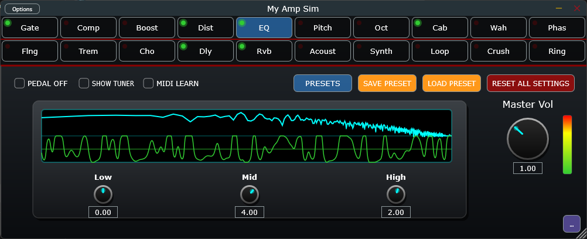

# 🎸 My Amp Sim (V1.0)
**A high-performance, hardware-accelerated Guitar Amp & Multi-FX Simulator built in C++ and JUCE.**


## 📌 Overview
Developed as a deep dive into Digital Signal Processing (DSP) and real-time audio architecture, **My Amp Sim** is a fully functional, zero-latency virtual guitar rig. It features a completely dynamic 20-slot routing matrix, multi-threaded audio visualization, and a suite of mathematically modeled effects ranging from 4x oversampled tube distortion to AMDF-tracked polyphonic synthesizers.



## ✨ Core Features
* **Dynamic Routing Matrix:** A drag-and-drop 20-pedal architecture allowing for infinite signal chain combinations.
* **Real-Time Visualizer (Lock-Free FIFO):** A dual-screen 60fps GUI block featuring a time-domain oscilloscope and an FFT-driven frequency spectrum analyzer, safely bridged from the Audio Thread to the Message Thread via a custom lock-free ring buffer.
* **Advanced DSP Math:** * **Distortion:** 4x Oversampled hyperbolic tangent (`std::tanh`) wave shaping for aliasing-free tube and fuzz emulation.
  * **Pitch Tracking:** Implements the Average Magnitude Difference Function (AMDF) for highly accurate, low-latency fundamental frequency detection in the Guitar Synthesizer and Tuner.
  * **Modulation:** Analog-modeled "Bucket Brigade" (BBD) Chorus utilizing custom IIR low-pass warmth filters.
* **Hardware MIDI Integration:** A real-time "MIDI Learn" CC parser, allowing users to instantly bind physical expression pedals or MIDI hardware to any UI parameter.
* **Automated Asset Pipeline:** Factory Cabinet Impulse Responses (`.wav`) and application binaries (`.png` icons) are dynamically detected by CMake and natively embedded into the binary using JUCE's `BinaryData`, eliminating the need for external file management.
* **The Tone Vault:** A first-boot XML factory system that automatically installs 75+ historically accurate presets mimicking legendary rigs (Vai, EVH, Malmsteen, Metallica).

## 🛠️ Tech Stack & Architecture
* **Language:** C++17
* **Framework:** JUCE (Audio Plugin Framework & GUI)
* **Build System:** CMake
* **Threading:** Strict separation of DSP (`processBlock`) and UI (`Message Thread`) using `std::atomic` variables and lock-free FIFOs to guarantee zero audio dropouts.

## 👨‍💻 About the Developer
Developed by Augusto (Guto), a Computer Science student currently in his final year at FC-UNESP. This project serves as the foundational C++ architecture for an upcoming Course Completion Project (TCC) focused on real-time musical harmony analysis, combining advanced Fourier transforms with Machine Learning models.

## 🚀 Build & Deployment Instructions
This project utilizes a modern CMake pipeline. To build the highly optimized VST3 and Standalone formats:

1. Clone the repository and ensure you have CMake and MSVC (Visual Studio) installed.
2. Generate the build files and compile in **Release mode** to activate `-O3` optimizations:
```bash
mkdir build
cd build
cmake ..
cmake --build . --config Release
3. Locate the Binaries: The compiled files will be automatically placed in out/build/x64-Release/MyAmpSim_artefacts/
	Run the Standalone .exe directly, or copy the .vst3 file into C:\Program Files\Common Files\VST3 to use it in your DAW.

